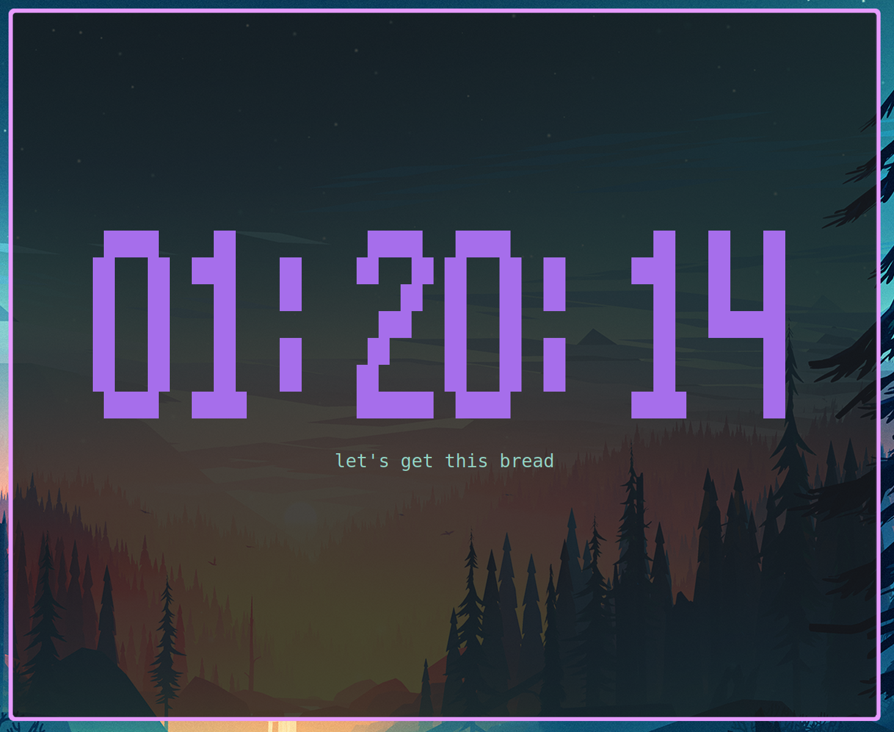

# Timer-CLI (Rust)

A Rust rewrite of the original Python countdown timer. The CLI renders large ASCII art digits in the center of the terminal, supports optional messages, and now lets you switch between a "classic" font and a blockier, high-contrast style for easier reading on translucent terminals.

The legacy Python sources are still available in `python base/` for reference, but the Rust implementation in `timer-rs/` is now the primary entry point.



## Inspiration

This rewrite builds on the original [timer-cli by 1Blademaster](https://github.com/1Blademaster/timer-cli), shared under the Apache-2.0 license. Huge thanks to them for the initial concept and Python implementation.

## Installation

```bash
cargo install timerr-cli
# or from the cloned repo
cargo install --path timer-rs
# run directly during development
cargo run --bin timerr -- <duration> [flags]
```

Cargo installs binaries into `~/.cargo/bin`. If your shell can't find `timerr`, add `export PATH="$HOME/.cargo/bin:$PATH"` to your shell rc (e.g. `~/.zshrc`) or start a new shell session after installing.

## Usage

```bash
timerr <duration> [OPTIONS]
timerr stopwatch [OPTIONS]
```

- Duration syntax matches the Python tool: `__h__m__s`, e.g. `25m`, `1h30m`, `5m30s`.
- `-m, --message <TEXT>` – show a note centered under the timer.
- `--no-bell` – suppress the repeating terminal bell after the timer ends.
- `-f, --font <classic|hashy|solid>` – `solid` (the default) renders chunky block characters, `classic` uses those lovely standard characters on your keyboard, and `hashy` uses `#`-based glyphs. You can also set `TIMER_FONT` to switch fonts globally.
- `--color <colour>` – choose the initial countdown colour. Accepted names: `pink`, `purple`, `green`, `blue`, `yellow`, `white`, `black`, or any `#RRGGBB` hex value (default `#785c9c`).
- `--auto-end` - automatically kill the timer when it ends. Useful for chaining commands or as a visible "sleep" timer.
- `stopwatch` - run an interactive stopwatch with millisecond precision and lap recording.

The timer changes colours as it counts down (green → yellow → red), uses the terminal’s alternate screen buffer for clean rendering, and beeps every 10 seconds after completion until interrupted (`Ctrl+C`).

### Stopwatch mode

Run:

```bash
timerr stopwatch
```

- Format: `HH:MM:SS.mmm`
- `SPACE` records a lap (`Lap 1`, `Lap 2`, ...)
- `ESC` toggles pause/resume (laps are ignored while paused)
- `q` exits stopwatch mode
- Laps are shown in the same TUI below the timer (newest first), and support keyboard scrolling (`Up`/`Down`, `PageUp`/`PageDown`, `Home`)
- On exit, a final elapsed time and lap summary are printed in the normal terminal

## Examples

```bash
# 25 minutes with a label and the blocky font
timerr 25m -m "Review pull requests" --font hashy

# 1 hour, silence the bell
timerr 1h --no-bell

# Stopwatch mode
timerr stopwatch
```
